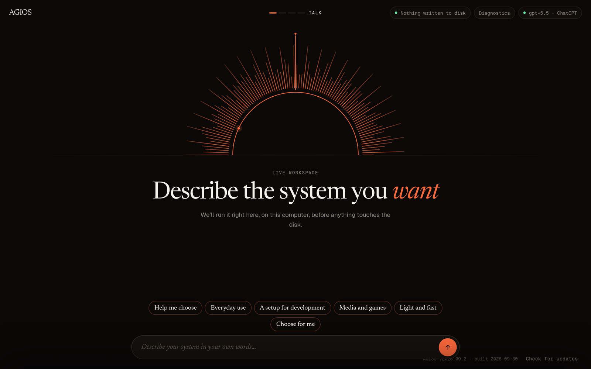
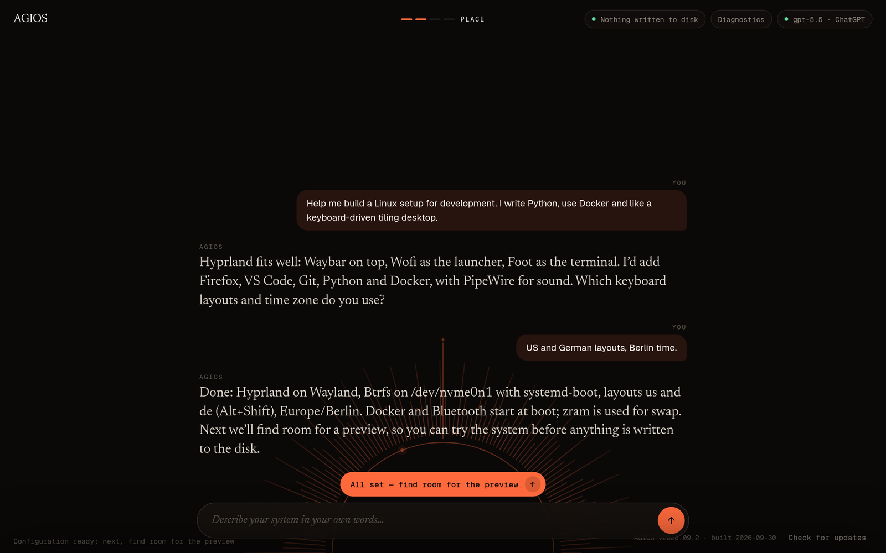
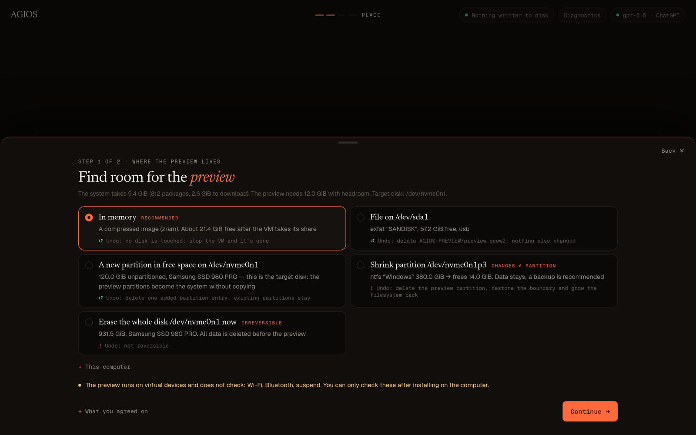
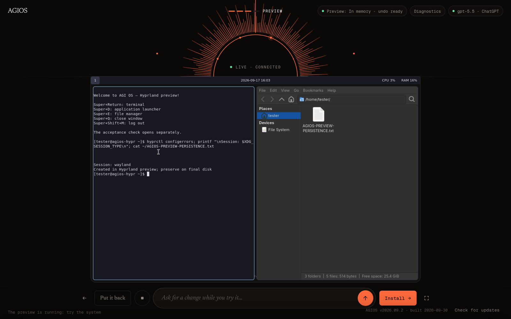
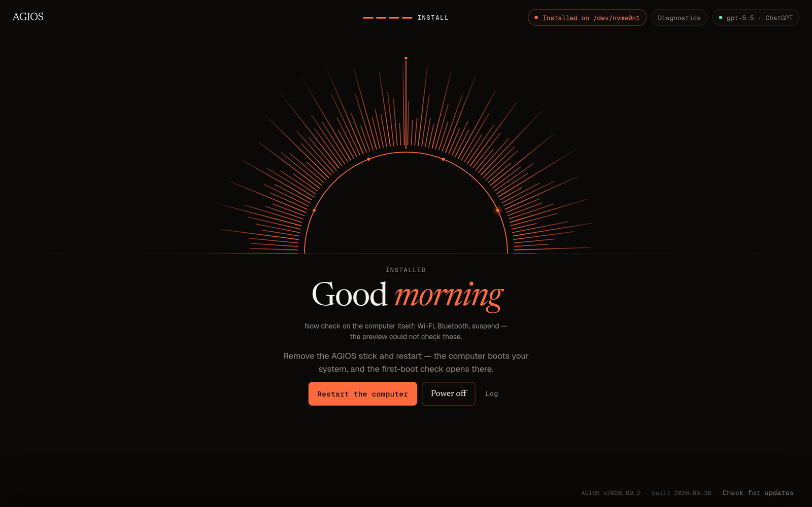

<p align="center">
  
</p>

<p align="center">
  <b>An Arch Linux installer you talk to.</b><br>
  Describe the system you want, try it in your browser, then install it — nothing touches the disk until you say so.
</p>

<p align="center">
  <sub><i>AGIOS reads as “AGI OS” — and as ἅγιος (hágios), Greek for “holy”.</i></sub>
</p>

<p align="center">
  <a href="https://github.com/ZeusKronid/agi-os/releases"></a>
  <a href="https://github.com/ZeusKronid/agi-os/actions/workflows/iso.yml"></a>
  <a href="https://github.com/ZeusKronid/agi-os/actions/workflows/tests.yml"></a>
  <a href="LICENSE"></a>
</p>

<p align="center">
  <a href="https://agios.complexity.solutions"><b>Website</b></a> ·
  <a href="#download">Download</a> ·
  <a href="#how-it-works">How it works</a> ·
  <a href="#build-from-source">Build</a> ·
  <a href="#documentation">Docs</a>
</p>

<p align="center">
  
</p>

## Why AGIOS

- **Talk, don't configure.** An agent picks the desktop, packages and settings from the official Arch repositories; the installer validates every proposal against the real package catalog and your hardware.
- **Try before you install.** The system is built in a VM inside the Live session and shown right in the browser. Use it, ask for changes, rebuild.
- **Undo by default.** The preview lives in RAM, in a file on a USB stick or in a temporary partition — each with its own rollback. Disks change only after an explicit, typed confirmation.
- **Bring your own model.** ChatGPT sign-in, OpenAI, Anthropic, Gemini, Ollama on your network, or any OpenAI-compatible API. Passwords never reach the model.

## How it works

Boot the Live ISO — Firefox opens the workspace at `localhost:8787`.

<table>
  <tr>
    <td width="50%"></td>
    <td width="50%"></td>
  </tr>
  <tr>
    <td><b>1 · Talk.</b> Describe how you use the computer. The agent asks what it needs and proposes a configuration.</td>
    <td><b>2 · Place.</b> AGIOS measures the exact system size and lists where the preview can live, each with its undo.</td>
  </tr>
  <tr>
    <td></td>
    <td></td>
  </tr>
  <tr>
    <td><b>3 · Preview.</b> The installed system boots in a VM and streams into the page through Apache Guacamole.</td>
    <td><b>4 · Install.</b> Keep it or put everything back. Installing promotes or copies the checked system to your disk.</td>
  </tr>
</table>

### Where the preview lives

| Option | Touches your disks | Undo |
|---|---|---|
| **RAM** (compressed zram image) | No | Stop the VM |
| **File** on any drive — USB stick, second disk, SD card | Writes one file | Delete the file |
| **New partition** in unallocated space | Adds one partition entry | Remove the entry |
| **Shrink** an NTFS/ext4 partition (dry run first) | Moves a partition boundary | Restore the boundary, grow the filesystem |
| **Erase** the target disk | Yes | ⚠️ Irreversible |

<details>
<summary><b>Supported install targets</b></summary>

- Filesystems: ext4, Btrfs, XFS, F2FS
- Partition tables: GPT, or MBR (msdos) with GRUB on BIOS
- Bootloaders: GRUB (BIOS/UEFI) or systemd-boot (UEFI), optionally signed for Secure Boot with your own keys
- LUKS2 root encryption, zram swap, optional hibernation via a swap file (not on F2FS)
- Alongside other systems: a preview partition on the target disk becomes the system without copying; any other preview is copied and verified by checksum. On MBR this needs two free primary entries.

After installing, remove the stick and reboot — the first-boot check (`agi-os-verify`) opens in the new system.
</details>

## Download

Signed releases are on the **[Releases page](https://github.com/ZeusKronid/agi-os/releases)**. Verify before writing the stick:

```sh
python3 scripts/release/verify-iso.py agi-os-*.iso   # from a checkout of this repo
```

Release key fingerprint: `BA1D BAF6 09C7 6719 47DD A5E4 D1DF F581 C1F8 77D3`.
Plain `gpg` steps are in [download and verification](docs/download.md).

Untested builds from `main` are attached to [Live ISO workflow runs](https://github.com/ZeusKronid/agi-os/actions/workflows/iso.yml?query=branch%3Amain) as the `agi-os-iso` artifact (GitHub sign-in required, kept for 7 days).

> [!TIP]
> In the Live session the desktop user `agi` has passwordless sudo: `sudo pacman -S <package>` works for the session and is gone after reboot.

## Build from source

```sh
sudo ./scripts/build-iso.sh        # → out/agi-os-<date>-x86_64.iso (~2 GB)
```

One ISO built by `mkarchiso` from the official `core` and `extra` repositories with signature checks. It bundles the web workspace, the Guacamole 1.6.0 client and `guacd`; the preview VM boots headless from the same media. For reproducible builds, `scripts/ci/build-iso.sh` uses a pinned Arch container and an Arch Linux Archive snapshot — see [CI and builds](docs/ci.md).

<details>
<summary><b>Development</b></summary>

```sh
python -B -m unittest discover -s tests -v                       # installer engine
.local/venv/bin/python -B -m unittest discover -s web/tests -v   # web workspace
node --check web/static/app.js

./scripts/run-live-web-vm.sh [--firmware bios] [--memory 16384]  # Live ISO in a test VM
./scripts/run-live-web-vm.sh --mode disk                         # boot the installed disk
```

| Path | What |
|---|---|
| `archiso/airootfs/usr/local/share/agi-os/installer/` | Shared installer engine |
| `web/` | Workspace server, preview storage, finalization |
| `web/static/` | Workspace UI |
| `site/` | Project website |

</details>

## Documentation

- [Live, preview and finalization](docs/local-web.md)
- [Installer architecture](docs/installer-architecture.md)
- [Testing an installed system](docs/installation-testing.md)
- [Development model bridge](docs/development-bridge.md)
- [CI and builds](docs/ci.md)
- [Download and verification](docs/download.md)

## License

Apache-2.0 ([LICENSE](LICENSE)). The Archiso-based profile keeps GPL-3.0-or-later ([archiso/LICENSE](archiso/LICENSE)). Guacamole and other packages in the image keep their own licenses; Guacamole's LICENSE and NOTICE ship in the Live ISO.
