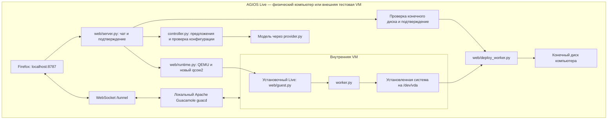

# Архитектура AGIOS

Основной интерфейс — сайт на localhost внутри загруженного AGIOS Live.
Для тестирования весь Live запускается во внешней VM; при загрузке с USB
этого внешнего уровня нет.

`agi-web.service` запускает сайт и контроллер от пользователя `agi`;
`agi-guacd.service` запускает локальный шлюз экрана. Firefox открывается
через `agi-installer` после загрузки рабочего стола. QEMU запускается тем же
непривилегированным пользователем с доступом к KVM.

Модель предлагает конфигурацию и запросы каталога пакетов. `domain.py` и
`controller.py` проверяют предложение. Подтверждение пользователя привязано
к хешу конфигурации; изменённую конфигурацию нужно подтвердить заново.
Модель не запускает команды установки напрямую.

После подтверждения `runtime.py` создаёт новый qcow2 и загружает внутреннюю
VM со встроенного установочного ISO. `guest.py` передаёт реальную инвентаризацию
диска через отдельный virtio-serial канал. Контроллер отправляет конфигурацию,
отпечаток диска и пароль; worker повторно проверяет диск и выполняет установку.
Worker работает с root-правами **внутри внутреннего установочного Live**.
Физические диски внешнего компьютера к VM не подключаются.

События worker отображаются на сайте. После успешной установки VM выключается;
контроллер запускает тот же диск без ISO. Успешный запуск установки или QEMU
сам по себе не считается завершённой установкой. При ошибке отображается
неуспех, при остановке диск сохраняется. Успешно установленную VM можно
запустить снова, в том числе после перезапуска сайта при сохранённом хранилище.

Браузер передаёт ввод через WebSocket в guacd; guacd подключается к VNC
локального QEMU. Оба сервиса слушают только loopback в Live. Сайт проверяет
Host, Origin и заголовок запросов изменения состояния. API скриншотов нет.

Пароль системы не отправляется модели и не записывается в session.json.
API-ключи находятся в памяти адаптера. Подключение ChatGPT использует прежний
адаптер app-server; в тестовом режиме virtio-мост предоставляет только модель
из существующего входа разработчика. Код сайта и управление VM остаются в Live.

Ограничения хранения и сборки текущего прототипа описаны в
[Live workflow](local-web.md). Сохранившийся `app.py` — старый GTK-клиент
общего движка и не является интерфейсом нового Live-сеанса.

После проверки превью пользователь выключает гостевую систему. `deployment.py`
привязывает подтверждение к образу, конфигурации и отпечатку конечного диска.
`deploy_worker.py` запускается с root-правами внутри внешнего Live, проверяет
образ и ext4, переносит qcow2 на выбранный диск и побайтно сравнивает данные.
Затем он расширяет ext4, пересобирает initramfs, обновляет загрузчик и создаёт
новый идентификатор проверки первой загрузки. В тестовом Live разрешён только
отдельный виртуальный диск с serial `AGIOS_TARGET`. API блокирует параллельный
перенос, запуск превью и изменение конфигурации во время записи.
