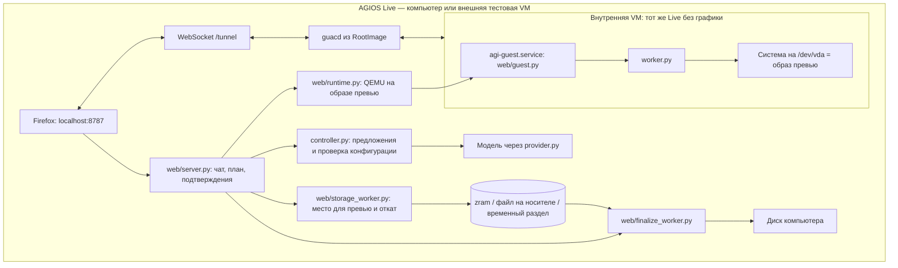

# Архитектура AGIOS

Основной интерфейс — сайт на localhost внутри загруженного AGIOS Live.
Для тестирования весь Live запускается во внешней VM; при загрузке с USB
этого внешнего уровня нет.

`agi-web.service` запускает сайт от пользователя `agi` (группы `kvm`, `disk`,
`optical`); привилегированные шаги выполняются короткими root-помощниками через
`sudo -n` с JSON на stdin: `storage_worker.py` (probe / prepare / revert) и
`finalize_worker.py`. `agi-guacd.service` запускает guacd из squashfs
(`RootImage=`). Внутренняя VM получает ядро и initramfs с загрузочного
носителя Live, сам носитель — только для чтения, и параметр `agios.guest`,
по которому запускается `agi-guest.service`, а сайт, guacd и рабочий стол — нет.

## Поток

1. **Диалог.** Модель предлагает конфигурацию и запросы каталога пакетов;
   `domain.py` и `controller.py` проверяют её. Модель видит реальные диски
   (путь, размер, модель, разделы, пригодность) и выбирает целевой диск. Модель
   не выполняет команды. `hardware.py` без привилегий собирает инвентаризацию
   компьютера (`lspci -vmmk -nn`, sysfs DMI/USB/net/power_supply/tpm/efivars,
   `/proc/cpuinfo`, `systemd-detect-virt`): процессор, память, корпус и батарея,
   GPU, Ethernet/Wi-Fi, звук, Bluetooth, TPM, Secure Boot. Она попадает в
   системный промпт как данные вместе со списком драйверов, которые добавит
   установщик, и списком того, что превью проверить не может; модель драйверы
   не подбирает. Те же данные показывает сайт («Железо этого компьютера») и
   обзор конфигурации.
2. **План.** `Catalog.estimate` считает точный размер: `pacman -Sp` с пустой
   локальной базой (все зависимости) и `pacman -Si` (Installed Size); запас
   +20 % и +2 ГиБ. `storage_worker.py probe` перечисляет варианты: память
   (`MemAvailable − RAM VM − 5 ГиБ ≥ размер / 1.3`), файл в свободном месте
   любой ФС другого носителя (временное ro-монтирование для statvfs), раздел в
   неразмеченном месте GPT-диска (`sfdisk --json`, выравнивание 1 МиБ), ужатие
   NTFS/ext4 целевого диска (`ntfsresize --info`, `resize2fs -P`), стирание.
   Ответ привязан к дайджесту: конфигурация + отпечаток диска + список опций.
3. **Подтверждение.** Пароль и необязательный пароль LUKS вводятся в форме;
   для разрушительных вариантов (ужатие, стирание) требуется ввести путь.
   `prepare` создаёт хранилище (zram + ext4 + qcow2; файл qcow2 на носителе;
   раздел `AGIOS-PREVIEW`; резервная копия GPT перед любой правкой таблицы) и
   возвращает `image` + `revert`.
4. **Превью.** `runtime.py` запускает QEMU на образе (`discard=unmap`,
   `virtio-balloon` с free-page-reporting). `guest.py` передаёт инвентаризацию
   внутренней VM; контроллер отправляет конфигурацию с `disk=/dev/vda`,
   отпечаток, пароль и пароль шифрования; `worker.py` ставит систему партиями
   (`pacman -Scc` + `fstrim` между ними), настраивает LUKS2 (`encrypt` hook,
   `cryptdevice=`), zram-generator, загрузчик с fallback-записью и запись
   `installation.json`. Для памяти сайт следит за `mm_stat` zram и аккуратно
   останавливает установку при нехватке. Запрос установки несёт инвентаризацию
   реального компьютера (`hardware`): `hardware.driver_plan` детерминированно
   выводит из неё микрокод, mesa/vulkan/VA-API по вендору GPU (`nvidia-open`
   для Turing и новее, иначе nouveau), `wireless-regdb` для Wi-Fi,
   `sof-firmware`/`alsa-ucm-conf` и стек PipeWire, `bluez` + `bluetooth.service`,
   `power-profiles-daemon` для ноутбука (если пользователь не выбрал tlp,
   tuned или auto-cpufreq) — по железу компьютера, а не по virtio-устройствам
   VM; графический userspace добавляется только при графической сессии, а
   выбранный пользователем модуль NVIDIA или PulseAudio заменяет свой аналог.
   Для `linux-lts` добавляется `nvidia-open-lts`, для других ядер —
   `nvidia-open-dkms` с заголовками. Модули `nvidia*` попадают в drop-in
   `etc/mkinitcpio.conf.d/agi-os.conf` вместо hook `kms`. В привязку согласия
   входит отпечаток плана драйверов (не всего списка USB-устройств). Строки
   устройств очищаются от управляющих и bidi-символов до попадания в промпт и
   обзор. План и инвентаризация
   пишутся в `installation.json`; `agi-os-verify` проверяет пакеты и службы плана.
5. **Решение.** `revert` убирает хранилище по его виду (см. `storage_worker.py`).
   `finalize_worker.py` проверяет образ (запись установки, дайджест
   конфигурации, тип загрузки, шифрование), затем:
   - *promote*: раздел превью на целевом диске → вложенные разделы переносятся
     в GPT диска по тем же абсолютным секторам, вложенные сигнатуры обнуляются;
   - *copy*: новые разделы (BIOS-boot при BIOS, boot 1 ГиБ, корень), при
     шифровании — новый LUKS с тем же паролем, `rsync -aHAX` + проверочный
     проход с контрольными суммами, `genfstab`, обновление `options` записей
     загрузчика и `GRUB_CMDLINE_LINUX`.
   Затем `fit_drivers`: инвентаризация Live заново, недостающие пакеты плана
   доустанавливаются в chroot (`pacman -Syu --needed`, чтобы не получить
   частичное обновление), службы включаются; диск уже записан, поэтому любой
   сбой этого шага — не ошибка, а `final-warning` на странице и `warnings` в
   записи установки, которые `agi-os-verify` показывает как замечания; план
   драйверов реального компьютера записывается до установки, поэтому проверка
   «Драйверы под железо компьютера» не пройдёт, пока их не доустановят.
   Далее `mkinitcpio -P` в chroot (autodetect видит реальное железо),
   `bootctl install` / `grub-install` с записью в NVRAM, новый идентификатор
   приёмки. Успех переноса `copy` завершается откатом временного хранилища.

Пароли не попадают в историю диалога, `session.json` и события. Ключи
провайдеров живут в памяти адаптера. Сайт проверяет Host, Origin и заголовок
запросов изменения состояния.
