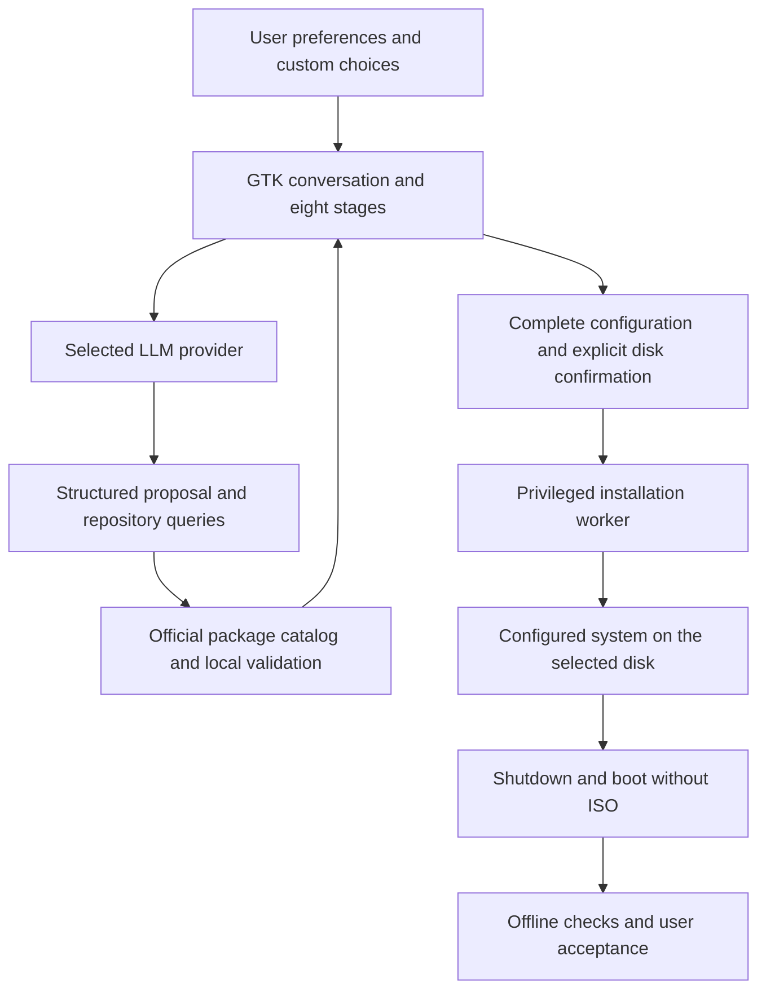

# Installer architecture

AGI OS now launches a native Python/GTK application. Codex is retained as one
provider backend for ChatGPT account sign-in; it is no longer the installer UI.

`app.py` owns the interface and local credential fields. `controller.py` keeps the
conversation and validates proposals before review. `providers.py` adapts OpenAI,
Anthropic, Gemini, Ollama and compatible APIs. `chatgpt.py` speaks the official
Codex app-server protocol in an isolated, ephemeral bubblewrap environment.

`domain.py` defines structured choices and their validation. The desktop field is
free text; packages, services and environment settings are selected through the
conversation and catalog. There is no application-maintained list of approved
desktops or window managers. The model has no shell tool in the installation
process. Its output cannot authorize a disk write or mark an installation complete.

`system.py` inventories firmware/disks and searches Core/Extra packages. Mounted,
read-only and undersized disks are excluded. `worker.py` rechecks eligibility and
the identity/consent fingerprint before running explicit installation commands.
The worker accepts typed data on stdin, not an executable script. Environment
files are validated relative paths inside the target; credentials and core account,
storage and permission configuration are handled separately.

Only the worker runs privileged, inside the booted live system. The GTK application
and provider connections run as the live user. The present live image still grants
that user passwordless sudo; application validation is not a host security sandbox
against a malicious local user.

API keys remain in memory. ChatGPT authentication uses a temporary home inside
bubblewrap and shares only the VM network for its browser callback. Host Codex
configuration, credentials, home files and block devices are not exposed to that
provider process. The installed user's password goes to the worker and `chpasswd`
over stdin and is absent from the model conversation, commands and installed record.

`verify.py` is copied to the target with a non-secret installation record. It checks
the actual root, user, packages and settings, requires a persistence marker across
two boot IDs, and records the user's checks of their requested workflows. XDG
autostart is provided where supported; custom compositors can launch the checker
manually. This supplies the first-use stage without transferring LLM credentials.

Storage handlers currently cover whole-disk GPT, ext4/Btrfs/XFS/F2FS and BIOS/UEFI
with GRUB or UEFI with systemd-boot. Other storage layouts need their own handlers;
this does not restrict environment/package choices. Failure recovery currently
reports partial state and cleans up mounts rather than attempting an automatic
fresh wipe. Full real-provider installation acceptance remains a separate test.
